  

  <h1>Who's Rei here!!</h1>
  
<strong>Web Developer • Data Science • Machine Learning</strong>

  
<em></em>

## About Me

  Who's Rei AKA Reza here! Aku adalah siswa RPL yang antusias pada web developer, data science dan juga machine learning!
  Dengan Orpheus Symphony Profile, Aku bisa memberikan data visual terkait progresku!

## Tech Stack

  
  
  
  
  

  
  
  
  
  

  
  
  

## Streak & Stats

  

  
  

  

